## 📅 Introduction
On May 24, 2024, at the Nextbeat Tech Bar’s ["First Discussion on Library Development"](https://nextbeat.connpass.com/event/312789/) in Japan, I presented an LT titled **"Secure Library Development"**.

The original presentation was in Japanese, and this article shares the content in English to extend our efforts to a broader audience.

<!-- truncate -->

## 🔍 Discovering OpenSSF
The [Open Source Security Foundation (OpenSSF)](https://openssf.org/) was established 2020 under the [Linux Foundation](https://www.linuxfoundation.org/).
Its mission is to ensure the sustainable safety of OSS development, maintenance, and use. We discovered OpenSSF while seeking security measures for ts-graphviz and found its initiatives highly relevant.

## 🛠️ Implementing Security Measures

### 📚 OpenSSF Guides
OpenSSF Guides offer comprehensive guidelines to improve OSS security. They include specific guides for technologies like npm and C/C++ compiler options, source code management settings, and vulnerability disclosure processes. These guides are valuable for both OSS developers and users.

### 🏅 OpenSSF Best Practices Badge
OSS developers can self-certify their projects by answering security-related questions and following best practices. Meeting these criteria makes packages more secure. OSS users can evaluate projects to ensure they follow best practices, helping them choose safer OSS.

### 🔍 OpenSSF Scorecard
The Scorecard is a CLI tool that automatically checks and evaluates security risks. It integrates with CI tools like GitHub Actions for continuous evaluation and publishes scores as reports. It can be installed in less than 10 minutes on GitHub Actions.

## 🚀 Benefits and Outcomes
Implementing these security measures significantly enhanced the security of ts-graphviz. We believe this can inspire other OSS projects to adopt similar measures, improving overall security in the open-source community.

## 🌟 Get Involved and Support
We invite you to support our efforts through OpenCollective and GitHub Sponsors. Your contributions help us maintain and improve the security of ts-graphviz.

Check out the English versions of the slides and speaker notes from our LT:

- [Google Slide](https://docs.google.com/presentation/d/e/2PACX-1vQAUNsc26XXbmIr2UaR3GtMd-iNADtJebK-FBgyqiNHVZ-1yQBxFuGOLKQohYejXjzm8C-DByC6ecmp/pub?start=false&loop=false&slide=id.p) / ([日本語](https://docs.google.com/presentation/d/e/2PACX-1vQKliPNP2Yiqq88xVnTsf944YtWhZY2DvSExc790pYmpthSR30SSxVpp06MMPmD6Ea1TqUfd44tflMI/pub?start=false&loop=false&slide=id.p))
- [Speaker Deck](https://speakerdeck.com/kamiazya/secure-library-development-practical-oss-security-with-openssf) / ([日本語](https://speakerdeck.com/kamiazya/sekiyuanaraiburarikai-fa-openssfdeshi-meruosssekiyuriteinoshi-jian-tohuo-yong))

## 📄 Slides with Speaker Notes

Those interested in a detailed walkthrough can access the slides along with the speaker notes used during the presentation. This provides a comprehensive view of the measures and insights shared:

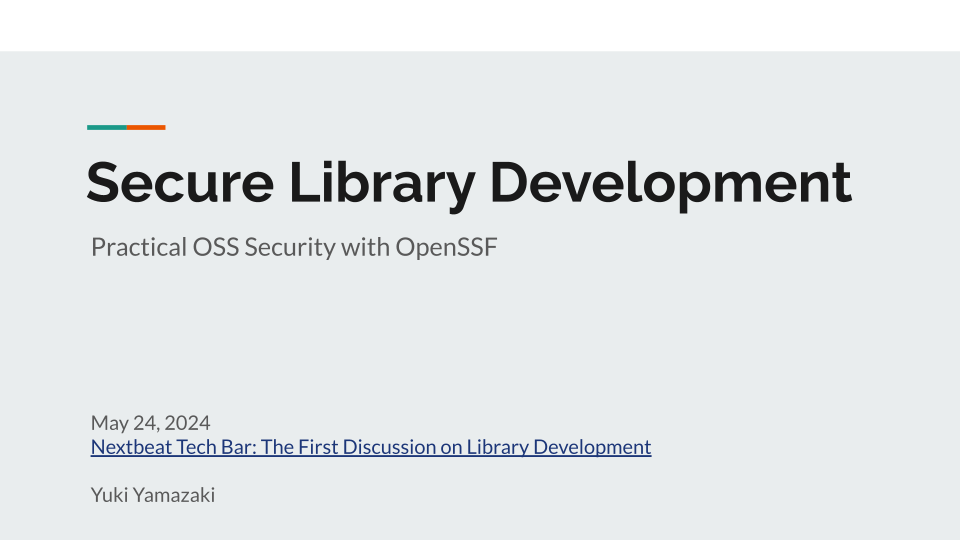

Today, I’d like to talk about "Secure Library Development" with a focus on the initiatives of OpenSSF.

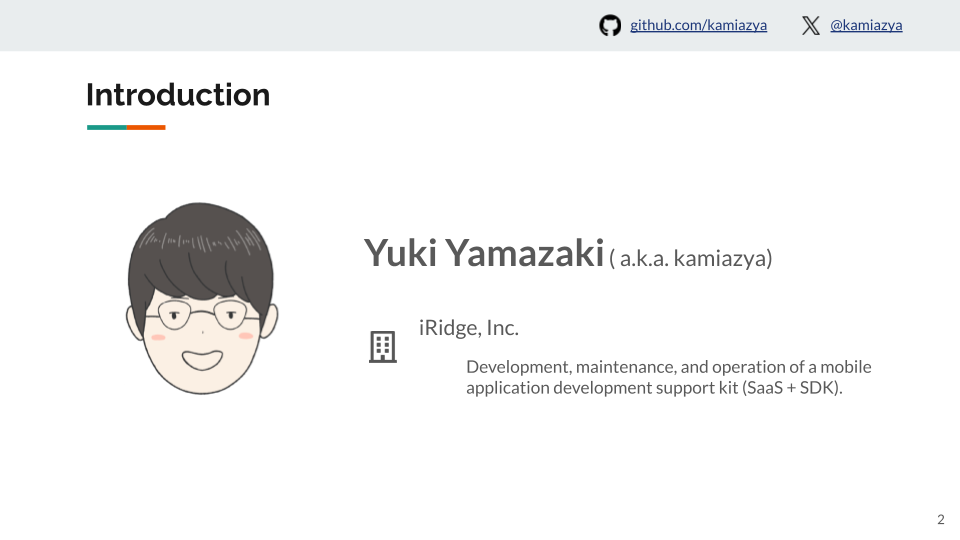

Hello, I’m Yuki Yamazaki, also known as kamiazya on GitHub and X(Twitter).
I work at iRidge, Inc., where I develop, maintain, and operate a mobile application development support kit (SaaS + SDK).

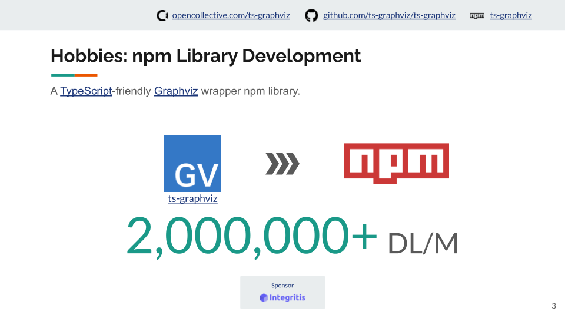

I developed a TypeScript-friendly Graphviz wrapper called ts-graphviz, which is available as an npm library.
It’s a minor library but is widely used by various OSS projects, achieving around 2 million downloads per month.

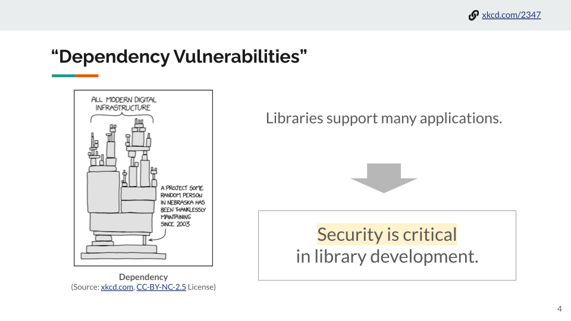

While I’m happy to see my library being used, it also raises concerns.
Modern applications rely on many open-source libraries, and even a small vulnerability in an obscure library like mine could have widespread implications.
Thus, security is crucial in library development.

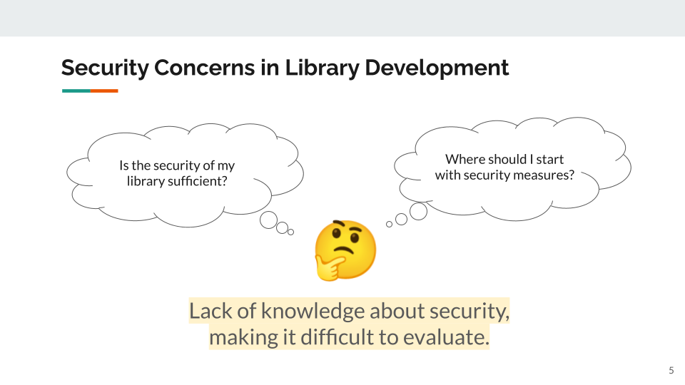

"Is the security of my library sufficient?"
"Where should I start with security measures?"

Lack of security knowledge made it difficult for me to evaluate my library’s security.

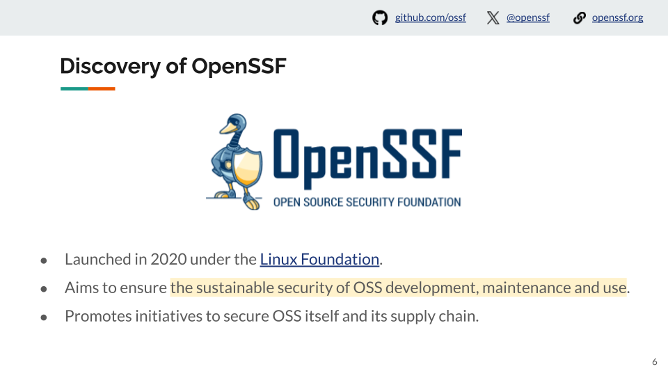

As I delved into security measures, I discovered OpenSSF (Open Source Security Foundation).

Established in 2020 under the Linux Foundation, OpenSSF aims to ensure the sustainable safety of OSS development, maintenance, and usage, promoting initiatives to secure both OSS itself and its supply chain.

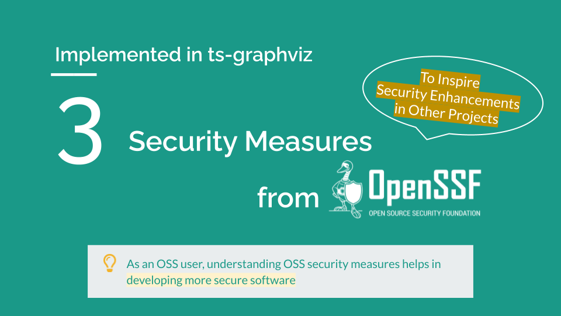

This LT introduces three security measures implemented in the ts-graphviz project using OpenSSF, which can also inspire other projects to improve their security.

As an OSS user, I believe that understanding OSS security measures through this presentation will help you develop more secure software.
Thank you for staying with me until the end.

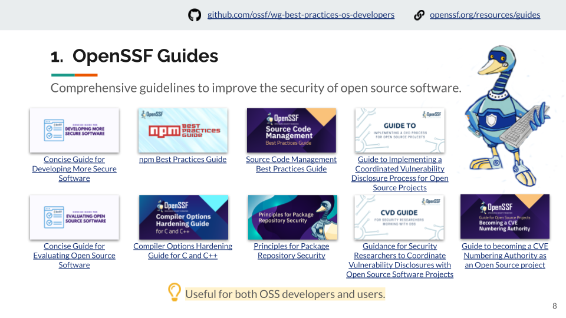

The first is the OpenSSF Guides.

These are comprehensive guidelines to improve the security of open-source software.
They include specific guides for technologies like npm and C/C++ compiler options, as well as niche topics like source code management settings and vulnerability disclosure processes.

The content is useful not only for OSS developers but also for users.

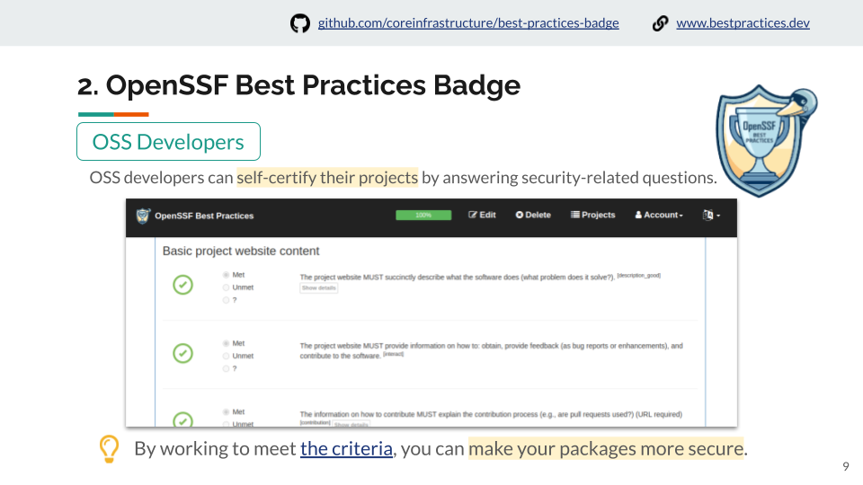

The second is the OpenSSF Best Practices Badge. OSS developers can self-certify their projects by answering security-related questions.
By working to meet the criteria, you can make your packages more secure.

The evaluation criteria are publicly available, so by striving to meet these criteria, you can enhance the security of your packages.

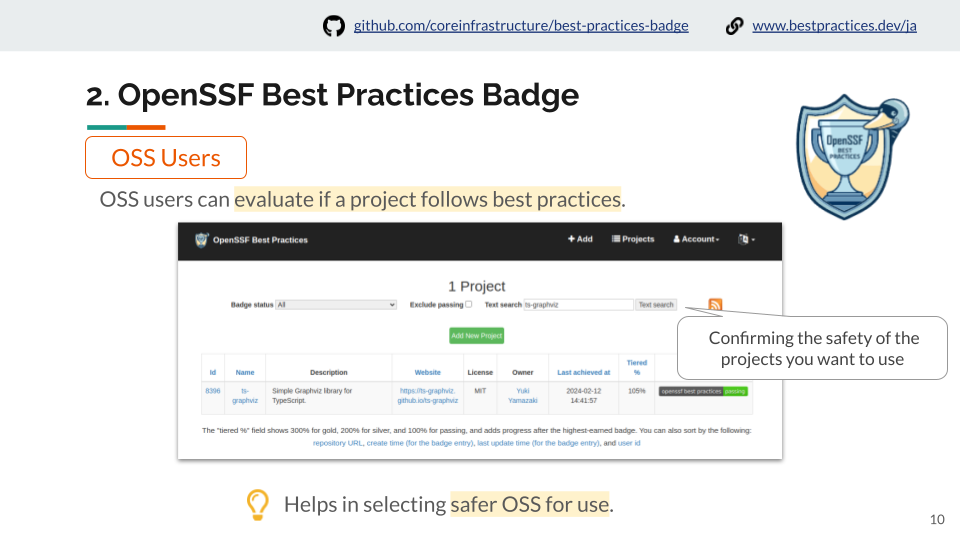

OSS users can evaluate if a project follows best practices, helping in selecting safer OSS for use.

By confirming the safety of the projects you want to use, you can select safer OSS.

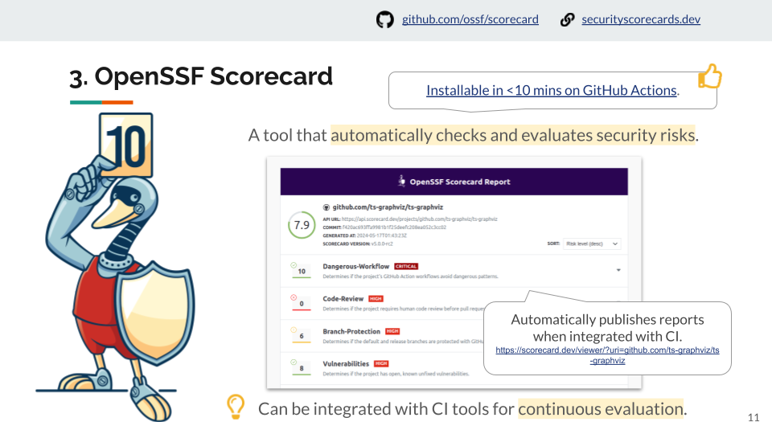

The third is the OpenSSF Scorecard.
This CLI tool automatically checks and evaluates security risks.
It can be integrated with CI tools like GitHub Actions for continuous evaluation. The score is published as a report.
Installable in less than 10 minutes on GitHub Actions.

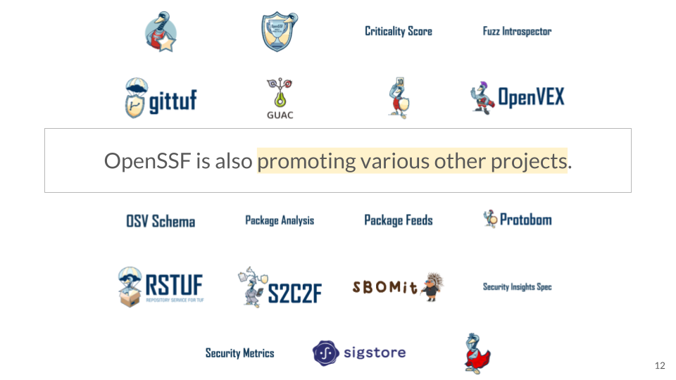

OpenSSF is also promoting various other projects.

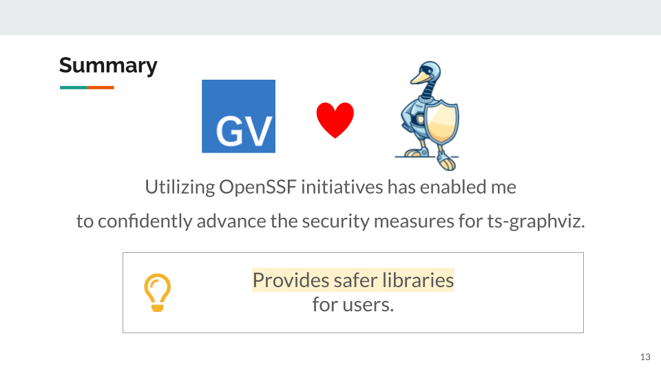

Utilizing OpenSSF initiatives has enabled me to confidently advance the security measures for ts-graphviz, providing safer libraries for users.

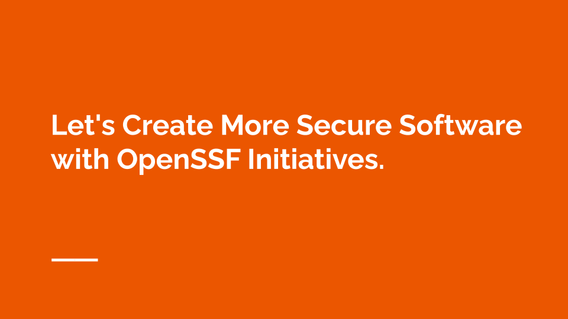

“Let's Create More Secure Software with OpenSSF Initiatives.”
I plan to continue utilizing OpenSSF initiatives to develop more secure software in the future.

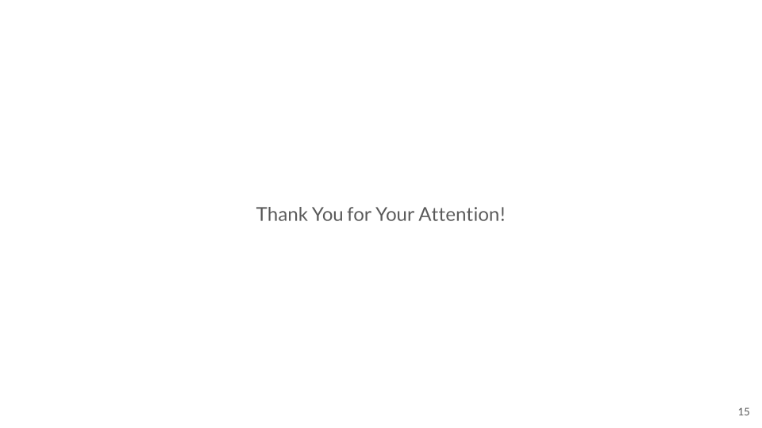

Thank you for your attention.

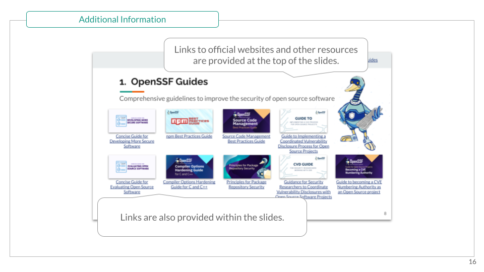

For more details, you can refer to the slides and additional resources linked within the presentation.
