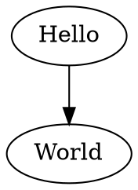

# Creating Your First Graph

Below is an example of creating a simple directed graph and generating DOT language.

```typescript
import { digraph, toDot } from 'ts-graphviz';

const G = digraph('G', (g) => {
  g.edge(['Hello', 'World']);
});

console.log(toDot(G));
```

## Generated DOT language:



## Explanation:

- **Importing the Library**: We import the `digraph` function from `ts-graphviz`, which allows us to create a directed graph.
- **Creating a Graph**: We create a new directed graph `G` with the name `'G'`.
- **Adding an Edge**: Within the graph context, we add an edge from `'Hello'` to `'World'` using the `edge` method.
- **Generating DOT Output**: We use the `toDot()` function to generate the DOT language representation of the graph and print it to the console.

## Visual Representation:


