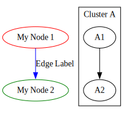

# Basic Concepts and Usage

In this section, we'll cover the fundamental concepts of `ts-graphviz` and how to use them to build graphs.

## Creating Nodes

Nodes are the basic units of a graph, representing entities or objects.

```typescript
g.node('Node1', { label: 'My Node', color: 'red' });
```

**Explanation:**

- **Node Identifier**: `'Node1'` is the unique identifier for the node.
- **Attributes**: Customize the appearance of the node by specifying attributes like `label` and `color`.

**Examples of Attributes:**

- `label`: Text displayed on the node.
- `color`: Color of the node.
- `shape`: Shape of the node (e.g., `box`, `circle`, `diamond`).

**More Information:**

- For a complete list of node attributes, refer to the [Graphviz Node Documentation](https://graphviz.org/docs/nodes/) and the [Attributes List](https://graphviz.org/doc/info/attrs.html).

## Creating Edges

Edges represent relationships or connections between nodes.

```typescript
g.edge(['Node1', 'Node2'], { label: 'Edge Label', color: 'blue' });
```

**Explanation:**

- **Connecting Nodes**: Define an edge between nodes using `['Node1', 'Node2']`.
- **Attributes**: Specify attributes like `label` and `color` for the edge.

**Examples of Attributes:**

- `label`: Text displayed on the edge.
- `color`: Color of the edge.
- `style`: Style of the edge (e.g., `dashed`, `bold`).

**More Information:**

- For a complete list of edge attributes, refer to the [Graphviz Edge Documentation](https://graphviz.org/docs/edges/) and the [Attributes List](https://graphviz.org/doc/info/attrs.html).

## Using Subgraphs

Subgraphs allow you to group nodes and edges, often used to create clusters or to control layout.

```typescript
g.subgraph('ClusterA', { label: 'Cluster A' }, (cluster) => {
  cluster.node('A1');
  cluster.node('A2');
  cluster.edge(['A1', 'A2']);
});
```

**Explanation:**

- **Creating a Subgraph**: Use the `subgraph` method to create a subgraph named `'ClusterA'`.
- **Subgraph Attributes**: Set attributes like `label` to name the subgraph.
- **Adding Nodes and Edges**: Define nodes and edges within the subgraph context provided by the callback function.

**More Information:**

- For more details on clusters, refer to the [Graphviz Clusters Documentation](https://graphviz.org/docs/clusters/).

---

## Putting It All Together

**Example:**

```typescript
import { digraph } from 'ts-graphviz';

const g = digraph('G', { newrank: true }, (g) => {
  g.node('Node1', { label: 'My Node 1', color: 'red' });
  g.node('Node2', { label: 'My Node 2', color: 'green' });

  g.edge(['Node1', 'Node2'], { label: 'Edge Label', color: 'blue' });

  g.subgraph('ClusterA', { label: 'Cluster A', color: 'lightgrey' }, (cluster) => {
    cluster.node('A1', { shape: 'box' });
    cluster.node('A2', { shape: 'ellipse' });
    cluster.edge(['A1', 'A2'], { style: 'dashed' });
  });
});
```

**Visual Representation:**



---

## Additional Information

For detailed information on the attributes and how to use them, refer to the official Graphviz documentation:

- [Graphviz Attributes List](https://graphviz.org/doc/info/attrs.html)

These resources provide comprehensive lists of attributes that can be applied to nodes, edges, and graphs, helping you customize your visualizations.
