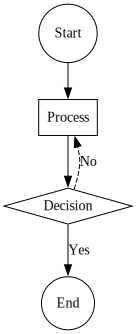

# Creating a Flowchart

Flowcharts are used to represent processes or workflows. Below is how you can create a simple flowchart.

```typescript
import { digraph, toDot } from 'ts-graphviz';

const G = digraph('Flowchart', (g) => {
  g.node('Start', { shape: 'circle' });
  g.node('Process', { shape: 'box' });
  g.node('Decision', { shape: 'diamond' });
  g.node('End', { shape: 'circle' });

  g.edge(['Start', 'Process']);
  g.edge(['Process', 'Decision']);
  g.edge(['Decision', 'End'], { label: 'Yes' });
  g.edge(['Decision', 'Process'], {
    label: 'No',
    constraint: false,
    style: 'dashed',
  });
});

console.log(toDot(G));
```

**Explanation:**

- **Nodes with Shapes**: Different shapes like `circle`, `box`, and `diamond` represent different types of steps.
- **Connecting Nodes**: Edges connect the steps to show the flow.
- **Edge Labels**: Labels like `'Yes'` and `'No'` on edges represent decision outcomes.

**Visualization:**


