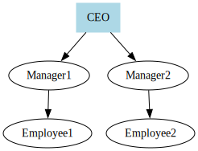

# Creating an Organizational Chart

Organizational charts display the structure of an organization.

```typescript
import { digraph, toDot } from 'ts-graphviz';

const G = digraph('Organization', (g) => {
  g.node('CEO', { shape: 'box', style: 'filled', color: 'lightblue' });

  g.edge(['CEO', ['Manager1', 'Manager2']]);
  g.edge(['Manager1', 'Employee1']);
  g.edge(['Manager2', 'Employee2']);
});

console.log(toDot(G));
```

**Explanation:**

- **Hierarchical Structure**: Nodes represent positions, and edges represent reporting lines.
- **Styling Nodes**: The CEO node is styled differently to highlight it.

**Visualization:**


