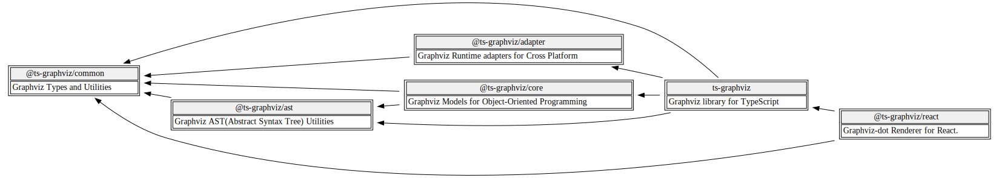

# Architecture and Design Principles

Understanding the architecture and design principles of `ts-graphviz` can help you utilize the library more effectively and contribute to its development.

## Design Principles

### Key Concepts

`ts-graphviz` is built around several key concepts that make it modular, extensible, and easy to use:

1. **TypeScript-First Design & Type Definitions**: Designed primarily for TypeScript, providing strong typing and seamless integration with TypeScript projects. The library includes comprehensive type definitions for DOT language elements, enabling type-safe interactions with Graphviz elements.

2. **Object-Oriented API**: Provides an object-oriented API for creating and manipulating graph elements like graphs, nodes, and edges. This makes working with complex graph structures intuitive and efficient.

3. **Modular Design**: Split into multiple packages, each serving a specific purpose. This modularity allows users to include only the functionality they need, improving maintainability and flexibility.

4. **AST Support**: Includes a module for processing the DOT language at the Abstract Syntax Tree (AST) level. This allows users to parse and generate DOT language while preserving its structure, making it easier to manipulate and transform graphs programmatically.

5. **Runtime Adapter**: Provides adapter functions that enable users to execute Graphviz commands across different runtime environments, such as Node.js and Deno. These adapters serve as a wrapper, allowing for seamless integration with various platforms.

6. **Extensibility**: Designed with extensibility in mind, allowing users to extend its functionality with custom implementations for specific use cases.

7. **Multi-Paradigm Support**: Accommodates various programming paradigms, such as Object-Oriented Programming, Declarative Programming, and Functional Programming. Users can choose the programming style that best suits their needs.

## Package Architecture

`ts-graphviz` consists of several packages, each with a specific role:

- **`ts-graphviz` (Main Package)**: Provides high-level APIs for creating and manipulating graphs, suitable for most users.

- **`@ts-graphviz/core`**: Contains core implementations of models and functions, used internally and available for advanced use.

- **`@ts-graphviz/common`**: Aggregates Graphviz domain knowledge, providing type definitions, constants, and utilities. Supports use cases like extending custom types and attributes.

- **`@ts-graphviz/ast`**: Offers tools for parsing, manipulating, and generating DOT language graphs at the AST level.

- **`@ts-graphviz/adapter`**: Executes Graphviz commands in various runtime environments (Node.js, Deno) and converts DOT strings to images.

- **`@ts-graphviz/react`**: Allows defining graphs using React's declarative UI paradigm, expressing DOT language models with JSX.

### Dependency Graph

The relationships between packages can be visualized as follows:

This modular architecture ensures:

- **Maintainability**: Individual packages can be maintained and updated without affecting others.

- **Flexibility**: Users can select only the packages needed for their specific use cases.

- **Extensibility**: Easier addition of new features or packages as the library evolves.

## Key Points

- **For Beginners**: Start with the main package `ts-graphviz`, which provides all the essential features for creating and manipulating graphs.

- **For Advanced Users**: Explore the internal packages if you need to extend functionality, customize behavior, or integrate with different environments.
