## 📅 はじめに

2024年5月24日、日本で開催された Nextbeat Tech Bar の[「第1回ライブラリ開発会議」](https://nextbeat.connpass.com/event/312789/)にて、「セキュアなライブラリ開発」というタイトルで LT を行いました。

元のプレゼンテーションは日本語で行われましたが、この記事では内容を英語でも共有し、より広いオーディエンスに私たちの取り組みをお伝えします。

<!-- truncate -->

## 🔍 OpenSSF の発見

[Open Source Security Foundation (OpenSSF)](https://openssf.org/) は、[Linux Foundation](https://www.linuxfoundation.org/) の下で 2020 年に設立されました。
その使命は、OSS の開発、保守、利用の持続可能な安全性を確保することです。ts-graphviz のセキュリティ対策を模索する中で、OpenSSF を発見し、その取り組みが非常に有用であることがわかりました。

## 🛠️ セキュリティ対策の実装

### 📚 OpenSSF ガイド

OpenSSF ガイドは、OSS のセキュリティを向上させるための包括的なガイドラインを提供します。npm や C/C++ のコンパイラオプションなどの特定の技術向けのガイドや、ソースコード管理設定、脆弱性開示プロセスなどのニッチなトピックも含まれています。これらのガイドは、OSS 開発者だけでなくユーザーにとっても価値があります。

### 🏅 OpenSSF ベストプラクティスバッジ

OSS 開発者は、セキュリティに関連する質問に答え、ベストプラクティスに従うことで、プロジェクトを自己認証できます。これらの基準を満たすことで、パッケージのセキュリティを高めることができます。OSS ユーザーは、プロジェクトがベストプラクティスに従っているかを評価し、より安全な OSS を選択するのに役立ちます。

### 🔍 OpenSSF スコアカード

スコアカードは、セキュリティリスクを自動的にチェックし評価する CLI ツールです。GitHub Actions などの CI ツールと統合して継続的な評価が可能で、スコアはレポートとして公開されます。GitHub Actions 上で10分以内にインストールできます。

## 🚀 利点と成果

これらのセキュリティ対策を実装することで、ts-graphviz のセキュリティが大幅に向上しました。他の OSS プロジェクトも同様の対策を採用し、オープンソースコミュニティ全体のセキュリティを向上させることができると信じています。

## 🌟 参加とサポートのお願い

私たちの取り組みを OpenCollective や GitHub Sponsors を通じてご支援いただけますと幸いです。皆さんのご協力が、ts-graphviz のセキュリティ維持と向上に役立ちます。

LT で使用したスライドと発表者ノートの英語版をご覧ください：

- [Google スライド](https://docs.google.com/presentation/d/e/2PACX-1vQKliPNP2Yiqq88xVnTsf944YtWhZY2DvSExc790pYmpthSR30SSxVpp06MMPmD6Ea1TqUfd44tflMI/pub?start=false&loop=false&slide=id.p) / ([英語](https://docs.google.com/presentation/d/e/2PACX-1vQAUNsc26XXbmIr2UaR3GtMd-iNADtJebK-FBgyqiNHVZ-1yQBxFuGOLKQohYejXjzm8C-DByC6ecmp/pub?start=false&loop=false&slide=id.p))
- [Speaker Deck](https://speakerdeck.com/kamiazya/sekiyuanaraiburarikai-fa-openssfdeshi-meruosssekiyuriteinoshi-jian-tohuo-yong) / ([英語](https://speakerdeck.com/kamiazya/secure-library-development-practical-oss-security-with-openssf))

## 📄 発表者ノート付きスライド

詳細な説明をご希望の方は、発表時に使用した発表者ノート付きのスライドをご覧ください。共有された対策や洞察の包括的なビューを提供します。

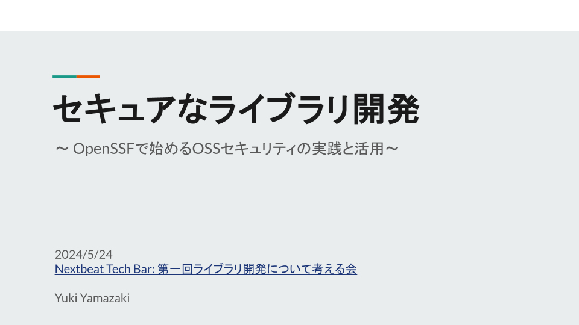

今日は、OpenSSF の取り組みに焦点を当てた「セキュアなライブラリ開発」についてお話ししたいと思います。

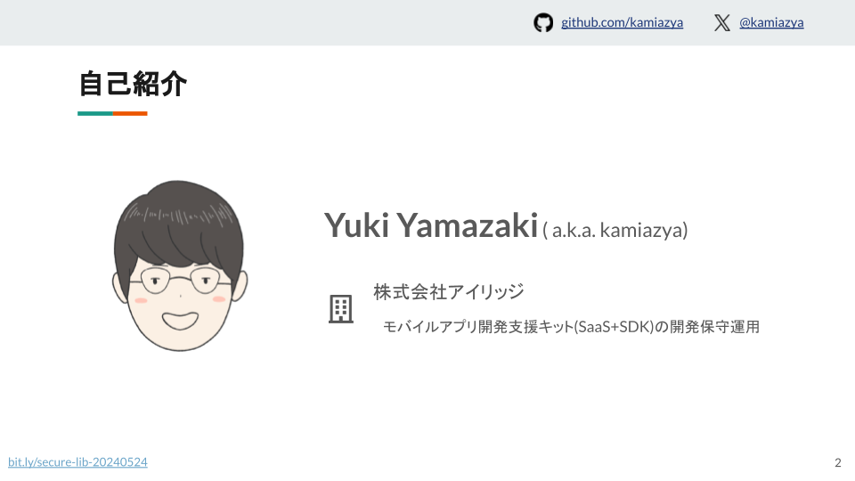

Yamazki Yuki と申します。よろしくおねがいします。
GitHub や X(Twitter) では kamiazya というアカウント名で活動しています。

普段は、株式会社アイリッジでモバイルアプリ開発支援キットの開発保守運用をしています。

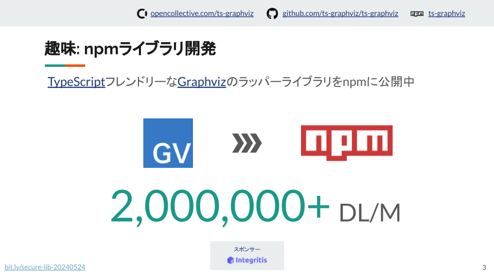

私は、TypeScript に適した Graphviz ラッパーである ts-graphviz を開発し、npm ライブラリとして提供しています。
これは小規模なライブラリですが、さまざまな OSS プロジェクトで広く利用されており、月間約 200 万ダウンロードを達成しています。

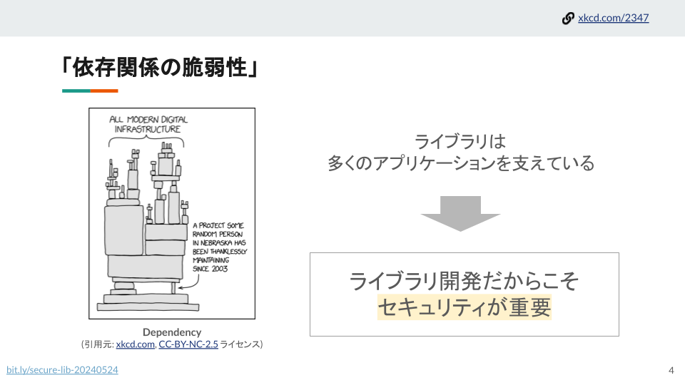

自分のライブラリが使用されていることは嬉しいですが、それと同時に懸念もあります。
現代のアプリケーションは多くのオープンソースライブラリに依存しており、私のような無名のライブラリに小さな脆弱性があっても、広範な影響を及ぼす可能性があります。
したがって、ライブラリ開発においてセキュリティは重要です。

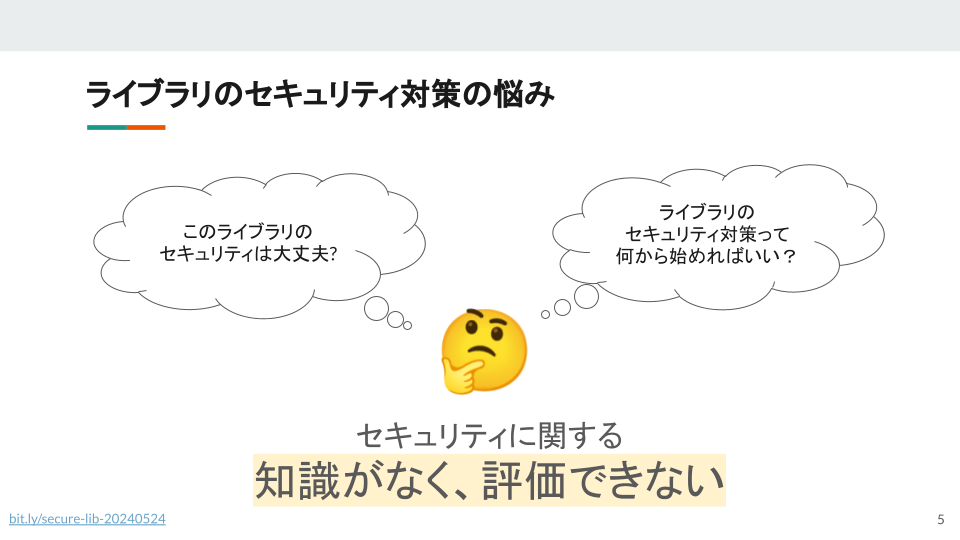

「自分のライブラリのセキュリティは十分だろうか？」
「セキュリティ対策はどこから始めればいいのだろうか？」

セキュリティの知識不足により、ライブラリのセキュリティを評価することが難しかったのです。

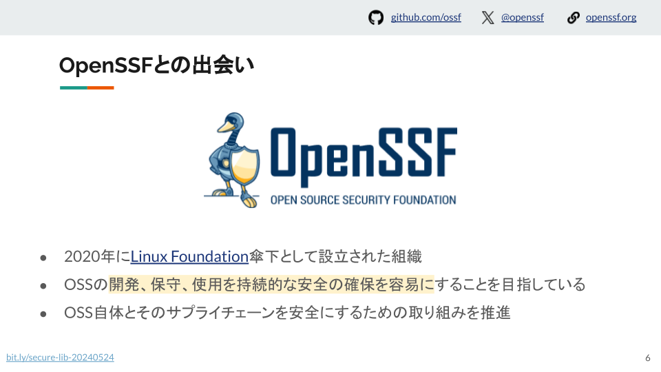

セキュリティ対策を深く掘り下げる中で、OpenSSF（Open Source Security Foundation）を発見しました。

OpenSSF は 2020 年に Linux Foundation の下で設立され、OSS の開発、保守、利用の持続可能な安全性を確保することを目的とし、OSS 自体とそのサプライチェーンを保護するための取り組みを推進しています。

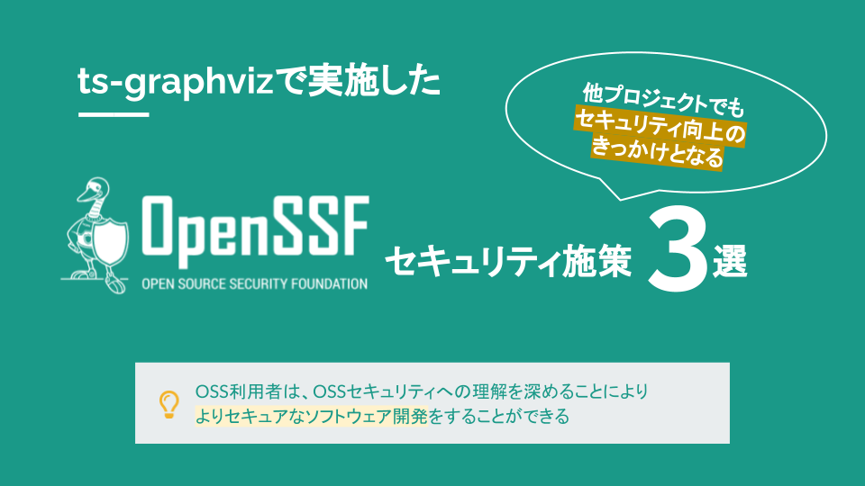

この LT では、ts-graphviz プロジェクトで OpenSSF を活用して実装した 3 つのセキュリティ対策を紹介します。これらは他のプロジェクトがセキュリティを改善するための刺激にもなるでしょう。

OSS ユーザーとして、このプレゼンテーションを通じて OSS のセキュリティ対策を理解することで、より安全なソフトウェアを開発できると信じています。

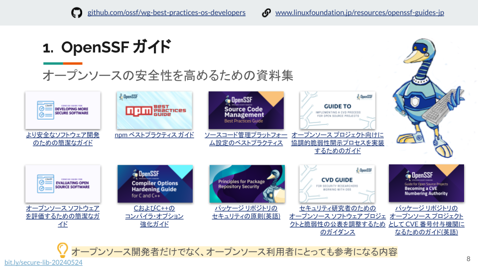

最初は OpenSSF ガイドです。

これは、オープンソースソフトウェアのセキュリティを向上させるための包括的なガイドラインを提供します。
npm や C/C++ のコンパイラオプションなどの特定の技術向けのガイドや、ソースコード管理設定、脆弱性開示プロセスなどのニッチなトピックも含まれています。

この内容は、OSS 開発者だけでなくユーザーにとっても有用です。

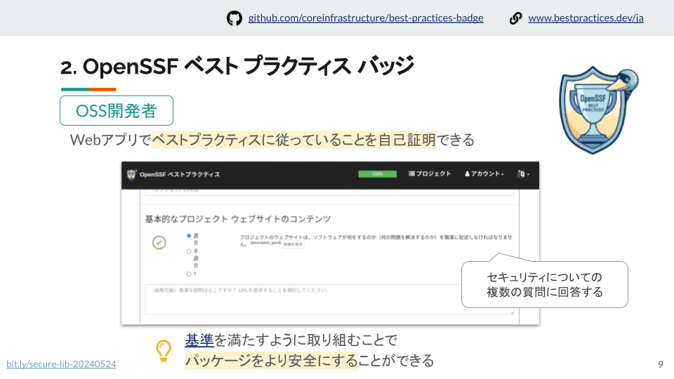

2 つ目は OpenSSF ベストプラクティスバッジです。OSS 開発者は、セキュリティに関連する質問に答えることで、プロジェクトを自己認証できます。
基準を満たすことで、パッケージのセキュリティを高めることができます。

評価基準は公開されているので、これらの基準を満たすよう努めることで、パッケージのセキュリティを向上させることができます。

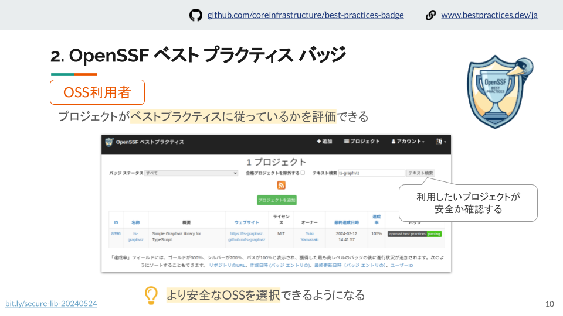

OSS ユーザーは、プロジェクトがベストプラクティスに従っているかを評価し、より安全な OSS を選択するのに役立ちます。

使用したいプロジェクトの安全性を確認することで、より安全な OSS を選択できます。

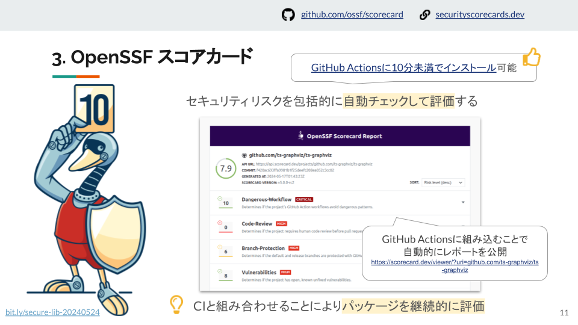

3 つ目は OpenSSF スコアカードです。
この CLI ツールは、セキュリティリスクを自動的にチェックし評価します。
GitHub Actions などの CI ツールと統合して継続的な評価が可能で、スコアはレポートとして公開されます。
GitHub Actions 上で 10 分以内にインストールできます。

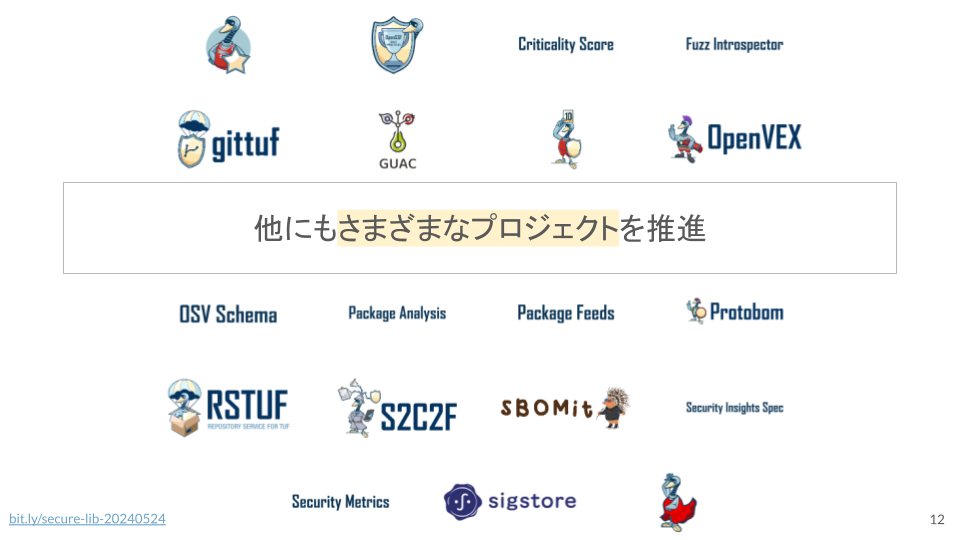

OpenSSF は他にもさまざまなプロジェクトを推進しています。

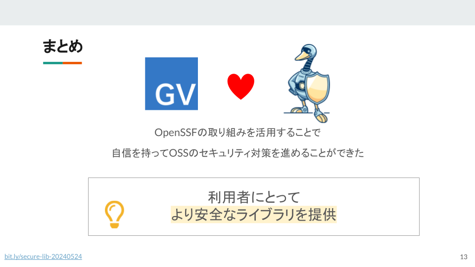

OpenSSF の取り組みを活用することで、ts-graphviz のセキュリティ対策を自信を持って進めることができ、ユーザーにより安全なライブラリを提供できます。

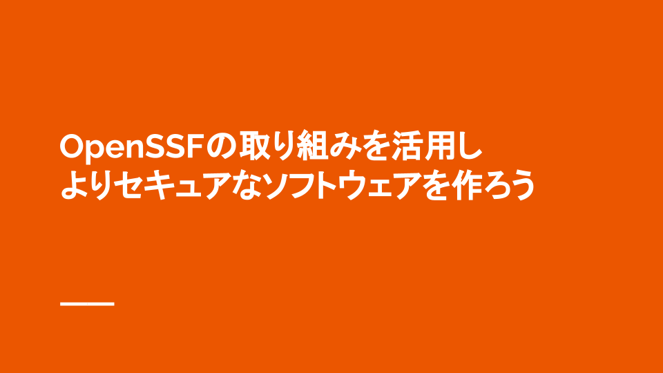

「OpenSSF の取り組みで、より安全なソフトウェアを一緒に作りましょう。」
今後も OpenSSF の取り組みを活用して、より安全なソフトウェアの開発を続けていきたいと思います。

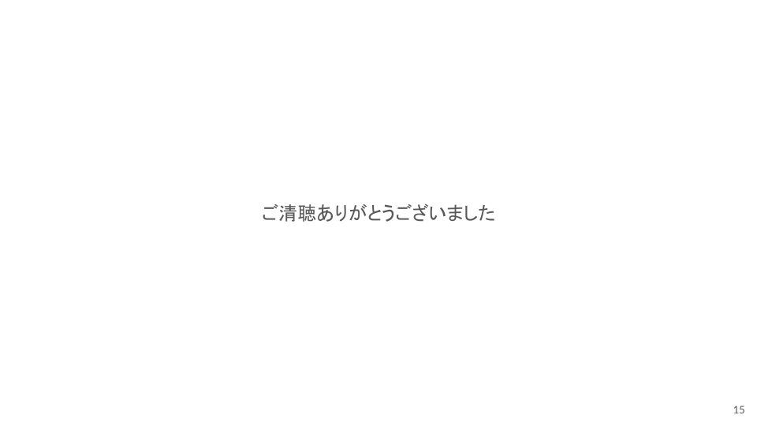

ご清聴ありがとうございました。

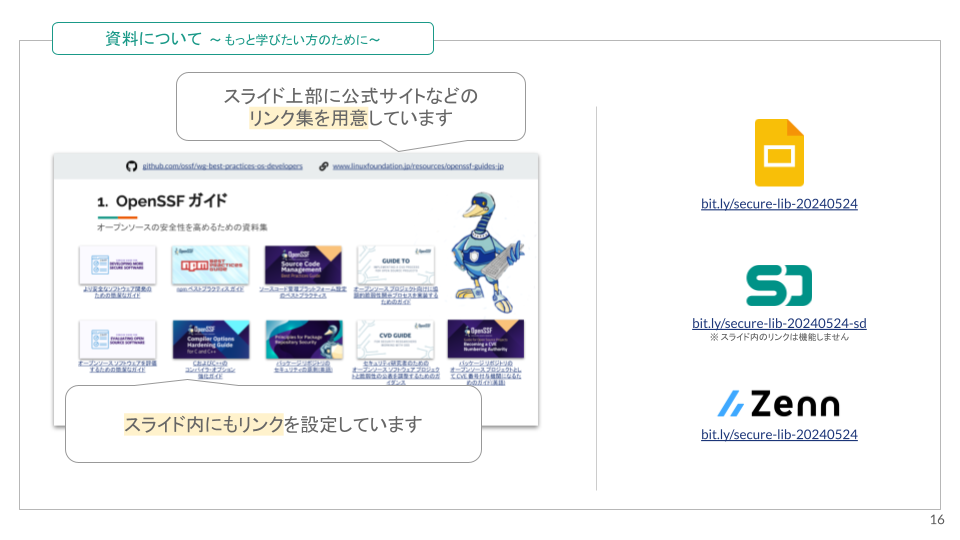

詳細については、プレゼンテーション内でリンクされたスライドや追加資料をご参照ください。
