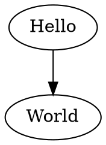

# クイックスタート

## インストール方法

### Node.js
パッケージマネージャーを使用してインストールできます。

```bash
# npm
npm install ts-graphviz
# yarn
yarn add ts-graphviz
# pnpm
pnpm add ts-graphviz
```

> **注記**: インストール前に試してみたい場合は、 [Runkit](https://npm.runkit.com/ts-graphviz) をご覧ください。

### Deno 🦕

[Deno v1.28 以降は npm をサポート](https://deno.land/manual/node/npm_specifiers)しています。

以下のように指定してパッケージをインポートできます。

```ts
import { toDot } from 'npm:ts-graphviz';
```

## 最初のグラフを作成する
以下は、シンプルな有向グラフを作成し、DOT 言語を生成する例です。

```ts
import { digraph } from 'ts-graphviz';

const g = digraph('G', (g) => {
  g.edge(['Hello', 'World']);
});

console.log(g.toDot());
```



### 基本的なコマンドと操作

- **グラフの作成**: `digraph` または `graph` 関数を使用します。
- **ノードの追加**: `node` メソッドを使用してノードを追加できます。
- **エッジの追加**: `edge` メソッドを使用してエッジを追加します。
- **属性の設定**: ノードやエッジに対して属性やスタイルを設定できます。
