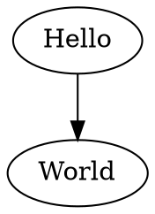
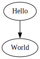

# 初めてのグラフを作成する

以下は、シンプルな有向グラフを作成し、DOT 言語を生成する例です。

```typescript
import { digraph, toDot } from 'ts-graphviz';

const G = digraph('G', (g) => {
  g.edge(['Hello', 'World']);
});

console.log(toDot(G));
```

## 生成された DOT 言語:



## 解説:

- **ライブラリのインポート**：`ts-graphviz` から `digraph` 関数をインポートします。これは、有向グラフを作成するために使用します。
- **グラフの作成**：名前 `'G'` の新しい有向グラフ `G` を作成します。
- **エッジの追加**：グラフのコンテキスト内で、`edge` メソッドを使用して `'Hello'` から `'World'` へのエッジを追加します。
- **DOT 出力の生成**：`toDot()` 関数を使用して、グラフの DOT 言語表現を生成し、コンソールに出力します。

## ビジュアル表現:


