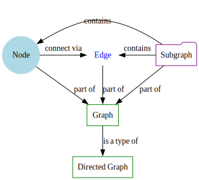

# 用語集

グラフ理論と ts-graphviz に関連する用語のまとめ。

- **ノード（Node）**：グラフの基本要素で、エンティティやオブジェクトを表します。
- **エッジ（Edge）**：ノード間の接続や関係を表す線。
- **グラフ（Graph）**：ノードとエッジからなる構造。
- **有向グラフ（Directed Graph、Digraph）**：エッジに方向があるグラフ。
- **サブグラフ（Subgraph）**：グラフの一部を形成するノードとエッジの部分集合。
- **属性（Attribute）**：ノード、エッジ、グラフの見た目や動作を定義するプロパティ。
- **DOT 言語（DOT Language）**：Graphviz で使用されるグラフ記述言語。

:::note
これらの関係性を参考のために可視化しました。

:::
