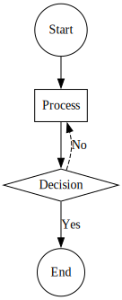

# フローチャートの作成

フローチャートは、プロセスやワークフローを表現するために使用されます。以下は、シンプルなフローチャートを作成する方法です。

```typescript
import { digraph, toDot } from 'ts-graphviz';

const G = digraph('Flowchart', (g) => {
  g.node('Start', { shape: 'circle' });
  g.node('Process', { shape: 'box' });
  g.node('Decision', { shape: 'diamond' });
  g.node('End', { shape: 'circle' });

  g.edge(['Start', 'Process']);
  g.edge(['Process', 'Decision']);
  g.edge(['Decision', 'End'], { label: 'Yes' });
  g.edge(['Decision', 'Process'], {
    label: 'No',
    constraint: false,
    style: 'dashed',
  });
});

console.log(toDot(G));
```

**解説:**

- **形状を持つノード**：`circle`、`box`、`diamond` などの異なる形状は、異なる種類のステップを表します。
- **ノードの接続**：エッジはステップを接続し、フローを示します。
- **エッジのラベル**：エッジ上の `'Yes'` や `'No'` といったラベルは、決定の結果を表します。

**ビジュアル化:**


