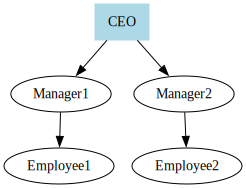

# 組織図の作成

組織図は、組織の構造を表示します。

```typescript
import { digraph, toDot } from 'ts-graphviz';

const G = digraph('Organization', (g) => {
  g.node('CEO', { shape: 'box', style: 'filled', color: 'lightblue' });

  g.edge(['CEO', ['Manager1', 'Manager2']]);
  g.edge(['Manager1', 'Employee1']);
  g.edge(['Manager2', 'Employee2']);
});

console.log(toDot(G));
```

**解説:**

- **階層構造**：ノードは役職を表し、エッジは報告ラインを表します。
- **ノードのスタイリング**：CEO ノードは強調するために異なるスタイルが適用されています。

**ビジュアル化:**


