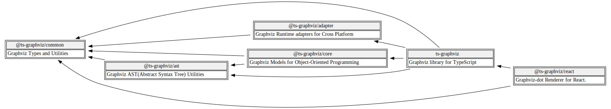

# パッケージアーキテクチャ

**ts-graphviz** は、各々が特定の役割を持つ複数のパッケージで構成されています：

- **`ts-graphviz`** (メインパッケージ): グラフの作成および操作のための高レベルAPIを提供し、ほとんどのユーザーに適しています。

- **`@ts-graphviz/core`**: モデルおよび関数のコア実装を含み、内部で使用されるほか、上級ユーザー向けに利用可能です。

- **`@ts-graphviz/common`**: Graphvizのドメイン知識を集約し、型定義、定数、およびユーティリティを提供します。カスタムタイプや属性の拡張といったユースケースをサポートします。

- **`@ts-graphviz/ast`**: ASTレベルでDOT言語のグラフをパース、操作、および生成するためのツールを提供します。

- **`@ts-graphviz/adapter`**: 様々なランタイム環境（Node.js、Deno）でGraphvizコマンドを実行し、DOT文字列を画像に変換します。

- **`@ts-graphviz/react`**: Reactの宣言的UIパラダイムを使用してグラフを定義することを可能にし、JSXでDOT言語モデルを表現します。

## サブモジュールとしての内部モジュールの公開

**ts-graphviz** パッケージは、内部モジュールの一部をサブモジュールとして公開しています。具体的には、以下のインポートパスを利用して内部モジュールにアクセスできます：

- **`ts-graphviz/ast`** または **`@ts-graphviz/ast`**
- **`ts-graphviz/adapter`** または **`@ts-graphviz/adapter`**

これにより、ユーザーはプロジェクトのニーズに応じて柔軟にモジュールを選択できます。
`ts-graphviz/<モジュール名>` スタイルを使用することで、`ts-graphviz` ライブラリ自体のみに依存関係を絞り、内部パッケージ（例: `@ts-graphviz/adapter` や `@ts-graphviz/ast`）のバージョンは `ts-graphviz` パッケージによって一元管理されます。
一方、`@ts-graphviz/<モジュール名>` スタイルを使用すると、必要な機能ごとに個別に依存関係を管理でき、特定のモジュールのみを選択的にインストールすることが可能です。

:::tip インポートパス選択時の依存関係管理

依存関係を厳密に管理するパッケージマネージャー（例: pnpm）を使用する場合、インポートパスの選択が依存関係の管理に大きな影響を与えることがあります。以下のポイントを参考にしてください：

- **`ts-graphviz/<モジュール名>` スタイルの利用**:
  - **利点**: `ts-graphviz` ライブラリ自体のみに依存関係を絞ることができ、内部パッケージ（例: `@ts-graphviz/adapter` や `@ts-graphviz/ast`）のバージョンは `ts-graphviz` パッケージによって一元管理されます。これにより、依存関係の衝突を防ぎ、ライブラリの推奨に基づいた安定したバージョンが使用されます。
  - **推奨シナリオ**: 依存関係を最小限に抑えたい場合や、`ts-graphviz` が内部で管理する依存パッケージに特別なバージョン要件がない場合。

- **`@ts-graphviz/<モジュール名>` スタイルの利用**:
  - **利点**: 必要な機能ごとに個別に依存関係を管理できるため、特定のモジュールのみを選択的にインストールし、アプリケーションの軽量化が図れます。
  - **注意点**: パッケージマネージャーで内部依存パッケージ（例: `@ts-graphviz/adapter` や `@ts-graphviz/ast`）も個別に管理する必要があります。これにより、依存関係のバージョン管理が複雑になる可能性があります。
  - **推奨シナリオ**: 特定のモジュールのみを使用したい場合や、依存関係の詳細な管理が必要な場合。

**まとめ**:
- **シンプルな依存関係管理**を希望する場合は、`ts-graphviz/<モジュール名>` スタイルを使用してください。
- **細かな依存関係の管理**や、特定のモジュールのみを利用したい場合は、`@ts-graphviz/<モジュール名>` スタイルを選択してください。

これにより、プロジェクトのニーズに最適な依存関係管理が可能となります。
:::

## 依存関係グラフ

パッケージ間の関係は以下のように視覚化できます：

このモジュラーアーキテクチャにより、以下が確保されます：

- **メンテナンス性**: 個々のパッケージを他に影響を与えることなく維持および更新できます。

- **柔軟性**: ユーザーは特定のユースケースに必要なパッケージのみを選択できます。

- **拡張性**: ライブラリの進化に伴い、新機能やパッケージの追加が容易になります。
