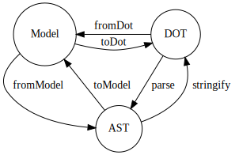

# 抽象構文木（AST）の使用

高度なユースケースでは、`@ts-graphviz/ast` を使用して DOT 言語グラフの抽象構文木（AST）を操作するための API を提供しています。

## 利用可能な関数

以下の関数が提供されています。

- `fromModel`: **Model** を **AST** に変換します。
- `toModel`: **AST** を **Model** に変換します。
- `stringify`: **AST** を **DOT** 文字列に変換します。
- `parse`: **DOT** 文字列を **AST** に変換します。



:::note
`ts-graphviz` パッケージで提供されている `toDot` 関数は、`fromModel` と `stringify` の合成です。`fromDot` 関数は、`parse` と `toModel` の合成です。
:::

## 例

### DOT 文字列を AST に解析する

```typescript
import { parse } from '@ts-graphviz/ast';

const ast = parse(`
  digraph example {
    node1 [
      label = "My Node",
    ]
  }
`);

console.log(JSON.stringify(ast, null, 2));
```

`ast` 変数には、DOT グラフの AST 表現が含まれており、プログラム的に操作できます。

<details>
<summary>AST 構造を表示するにはクリックしてください</summary>

```json
{
  "type": "Dot",
  "location": {
    "start": { "offset": 3, "line": 2, "column": 3 },
    "end": { "offset": 68, "line": 7, "column": 1 }
  },
  "children": [
    {
      "id": {
        "value": "example",
        "quoted": false,
        "type": "Literal",
        "location": {
          "start": { "offset": 11, "line": 2, "column": 11 },
          "end": { "offset": 18, "line": 2, "column": 18 }
        },
        "children": []
      },
      "directed": true,
      "strict": false,
      "type": "Graph",
      "location": {
        "start": { "offset": 3, "line": 2, "column": 3 },
        "end": { "offset": 67, "line": 6, "column": 4 }
      },
      "children": [
        {
          "id": {
            "value": "node1",
            "quoted": false,
            "type": "Literal",
            "location": {
              "start": { "offset": 25, "line": 3, "column": 5 },
              "end": { "offset": 30, "line": 3, "column": 10 }
            },
            "children": []
          },
          "type": "Node",
          "location": {
            "start": { "offset": 25, "line": 3, "column": 5 },
            "end": { "offset": 63, "line": 5, "column": 6 }
          },
          "children": [
            {
              "key": {
                "value": "label",
                "quoted": false,
                "type": "Literal",
                "location": {
                  "start": { "offset": 39, "line": 4, "column": 7 },
                  "end": { "offset": 44, "line": 4, "column": 12 }
                },
                "children": []
              },
              "value": {
                "value": "My Node",
                "quoted": true,
                "type": "Literal",
                "location": {
                  "start": { "offset": 47, "line": 4, "column": 15 },
                  "end": { "offset": 56, "line": 4, "column": 24 }
                },
                "children": []
              },
              "location": {
                "start": { "offset": 39, "line": 4, "column": 7 },
                "end": { "offset": 57, "line": 4, "column": 25 }
              },
              "type": "Attribute",
              "children": []
            }
          ]
        }
      ]
    }
  ]
}
```

</details>
