---
authors:
  - key: kamiazya
    title: 原文作者
  - key: hao
    title: 翻译协助
tags: [security]
description: |-
  概述了 ts-graphviz 如何通过利用开源安全基金会（OpenSSF）的倡议来增强安全性。文章概述了为保护和确保 ts-graphviz 生态系统所实施的措施，确保为用户提供更安全的开发环境。
---
# 利用 OpenSSF 保护和确保 ts-graphviz 发布 🛡️

## 📅 介绍
2024 年 5 月 24 日，由日本Nextbeat Tech Bar举办的 ["首次库开发讨论"](https://nextbeat.connpass.com/event/312789/) 活动中，我进行了题为 **"安全库开发"** 的主题演讲。

原文为日语，本文将内容分享为中文，希望对您有所帮助。

<!-- truncate -->

## 🔍 发现 OpenSSF
[开源安全基金会 (OpenSSF)](https://openssf.org/) 于 2020 年在 [Linux 基金会](https://www.linuxfoundation.org/) 下成立。
其使命是确保开源软件（OSS）开发、维护和使用的可持续安全性。我们在为 ts-graphviz 寻求安全措施时注意到了 OpenSSF，并赞同其倡议。

## 🛠️ 实施安全措施

### 📚 OpenSSF 指南
OpenSSF 指南提供了全面的开源软件安全改进指南。它们包括针对 npm 和 C/C++ 编译器选项等技术的具体指南、源代码管理设置以及漏洞披露流程。这些指南对 OSS 开发者和用户都非常有价值。

### 🏅 OpenSSF 最佳实践徽章
OSS 开发者可以通过回答与安全相关的问题并遵循最佳实践来自我认证他们的项目。满足这些标准可以使包更加安全。OSS 用户可以评估项目是否遵循最佳实践，帮助他们选择更安全的 OSS。

### 🔍 OpenSSF Scorecard
Scorecard 是一个 CLI 工具，可以自动检查和评估安全风险。它可以与 GitHub Actions 等 CI 工具集成进行持续评估，并将分数作为报告发布。它可以在 GitHub Actions 上在不到 10 分钟内安装完成。

## 🚀 益处和成果
实施这些安全措施显著增强了 ts-graphviz 的安全性。我们相信这可以激励其他 OSS 项目采用类似的措施，提升整个开源社区的安全性。

## 🌟 参与和支持
我们邀请您通过 OpenCollective 和 GitHub Sponsors 支持我们的努力。您的贡献将帮助我们维护和提升 ts-graphviz 的安全性。

查看我们 LT 的幻灯片和演讲者笔记的英文版本：

- [Google 幻灯片](https://docs.google.com/presentation/d/e/2PACX-1vQAUNsc26XXbmIr2UaR3GtMd-iNADtJebK-FBgyqiNHVZ-1yQBxFuGOLKQohYejXjzm8C-DByC6ecmp/pub?start=false&loop=false&slide=id.p) / ([日语](https://docs.google.com/presentation/d/e/2PACX-1vQKliPNP2Yiqq88xVnTsf944YtWhZY2DvSExc790pYmpthSR30SSxVpp06MMPmD6Ea1TqUfd44tflMI/pub?start=false&loop=false&slide=id.p))
- [Speaker Deck](https://speakerdeck.com/kamiazya/secure-library-development-practical-oss-security-with-openssf) / ([日语](https://speakerdeck.com/kamiazya/sekiyuanaraiburarikai-fa-openssfdeshi-meruosssekiyuriteinoshi-jian-tohuo-yong))

## 📄 带有演讲者笔记的幻灯片

有兴趣进行详细演示的读者可以访问幻灯片及演讲者笔记。这提供了对所实施措施和分享见解的全面了解：

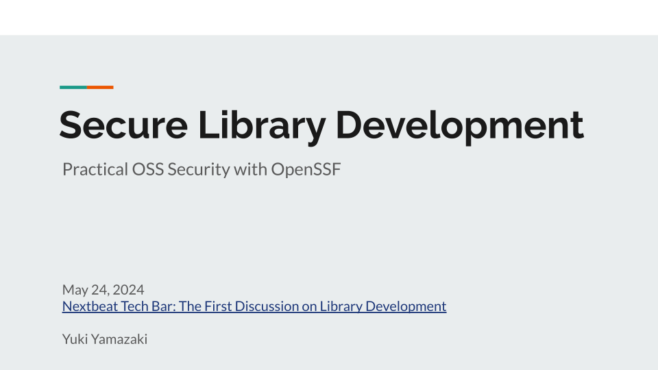

今天，我想谈谈“安全库开发”，重点介绍 OpenSSF 的倡议。

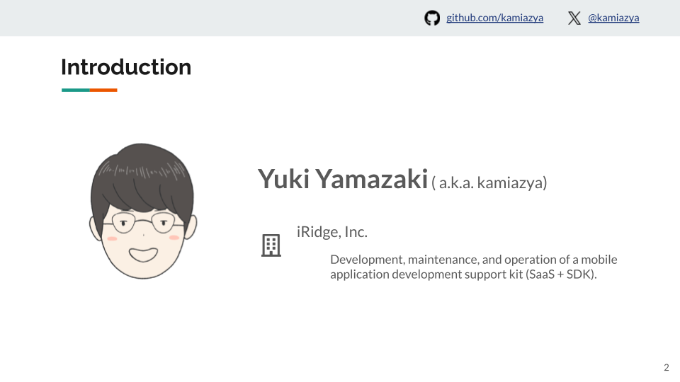

大家好，我是山崎佑纪，GitHub 和 X（Twitter）上的用户名是 kamiazya。
我在 iRidge, Inc. 工作，开发、维护和运营一个移动应用开发支持工具包（SaaS + SDK）。

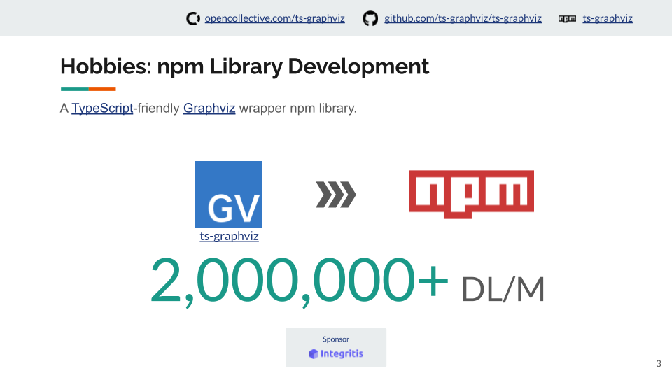

我开发了一个 TypeScript 友好的 Graphviz 包装器，名为 ts-graphviz，可作为 npm 库使用。
这是一个小型库，但被各种 OSS 项目广泛使用，每月下载量约为 200 万次。

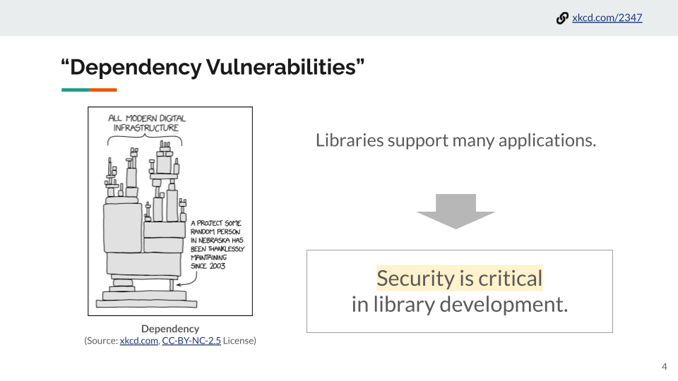

我很高兴看到我开发的库被很多人使用，但同时我也有所担忧。
现代应用程序依赖于许多开源库，即使是像我这样的冷门库中的一个小漏洞也可能产生广泛影响。
因此，库开发中的安全性至关重要。

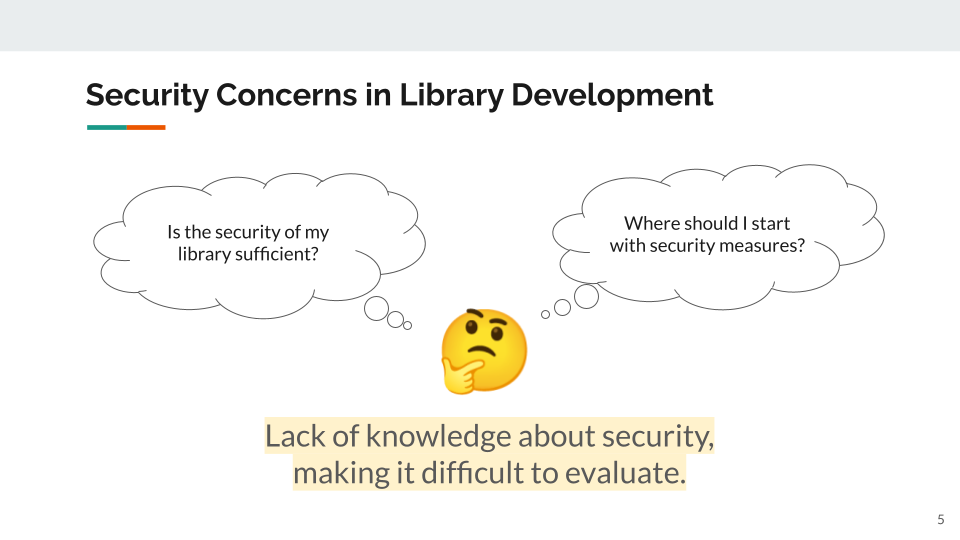

“我的库的安全性是否足够？”
“我应该从哪里开始实施安全措施？”

缺乏安全知识使我难以评估我的库的安全性。

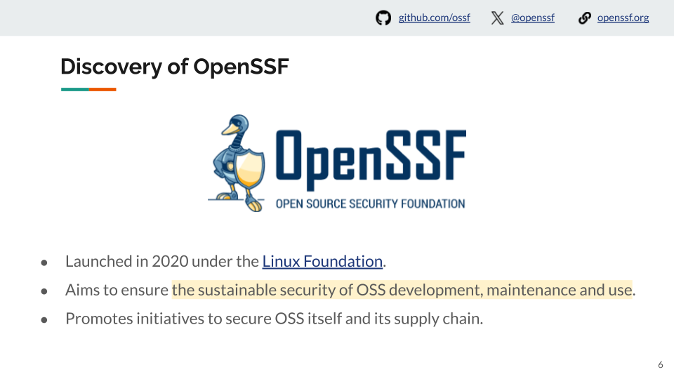

当我深入研究安全措施时，我发现了 OpenSSF（开源安全基金会）。

OpenSSF 于 2020 年在 Linux 基金会下成立，旨在确保 OSS 开发、维护和使用的可持续安全性，推动旨在保护 OSS 本身及其供应链的倡议。

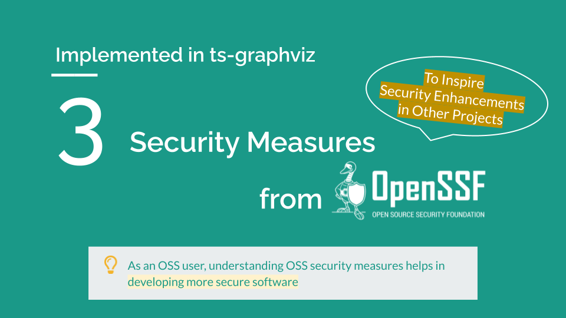

本次 LT 介绍了在 ts-graphviz 项目中使用 OpenSSF 实施的三项安全措施，这些措施也可以激励其他项目提升其安全性。

作为 OSS 用户，我相信通过本次演示了解 OSS 安全措施将帮助您开发更安全的软件。
感谢您一直陪伴到最后。

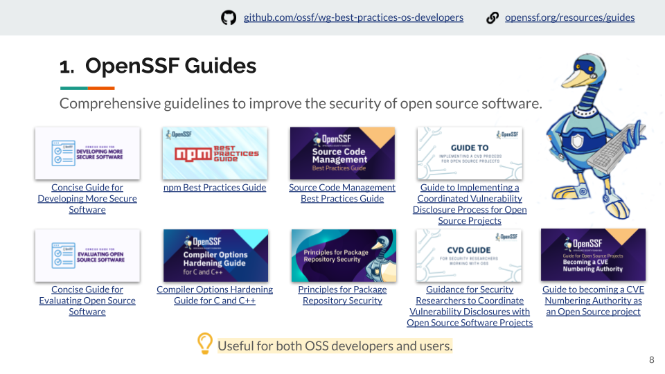

第一项是 OpenSSF 指南。

这些是全面的指南，用于提升开源软件的安全性。
它们包括针对 npm 和 C/C++ 编译器选项等技术的具体指南，以及源代码管理设置和漏洞披露流程等小众主题。

这些内容不仅对 OSS 开发者有用，对用户也非常有帮助。

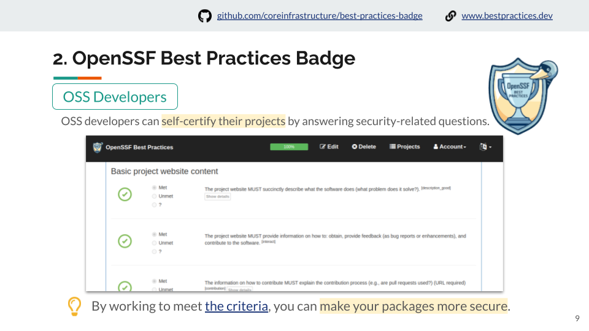

第二项是 OpenSSF 最佳实践徽章。OSS 开发者可以通过回答与安全相关的问题来自我认证他们的项目。
通过努力满足这些标准，您可以使您的包更加安全。

评估标准是公开的，因此通过努力满足这些标准，您可以提升包的安全性。

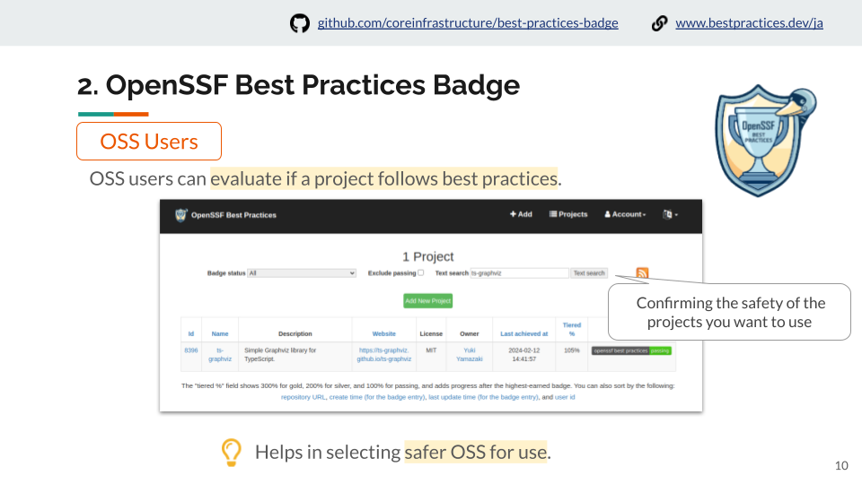

OSS 用户可以评估项目是否遵循最佳实践，帮助选择更安全的 OSS 进行使用。

通过确认您想要使用的项目的安全性，您可以选择更安全的 OSS。

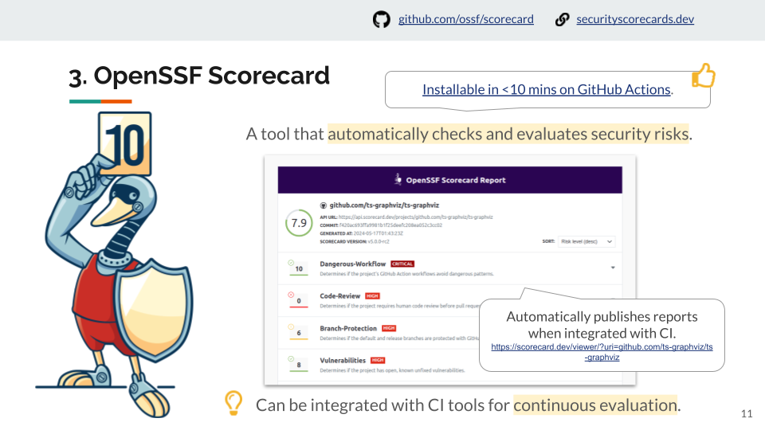

第三项是 OpenSSF Scorecard。
这个 CLI 工具可以自动检查和评估安全风险。
它可以与 GitHub Actions 等 CI 工具集成进行持续评估。评分会作为报告发布。
在 GitHub Actions 上安装时间不到 10 分钟。

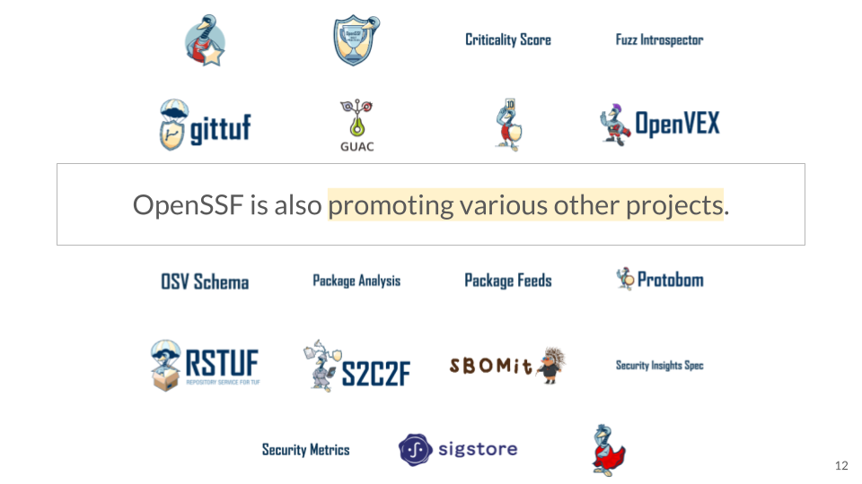

OpenSSF 还在推动各种其他项目。

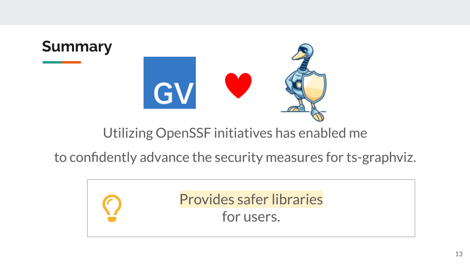

利用 OpenSSF 的倡议使我能够自信地推进 ts-graphviz 的安全措施，为用户提供更安全的库。

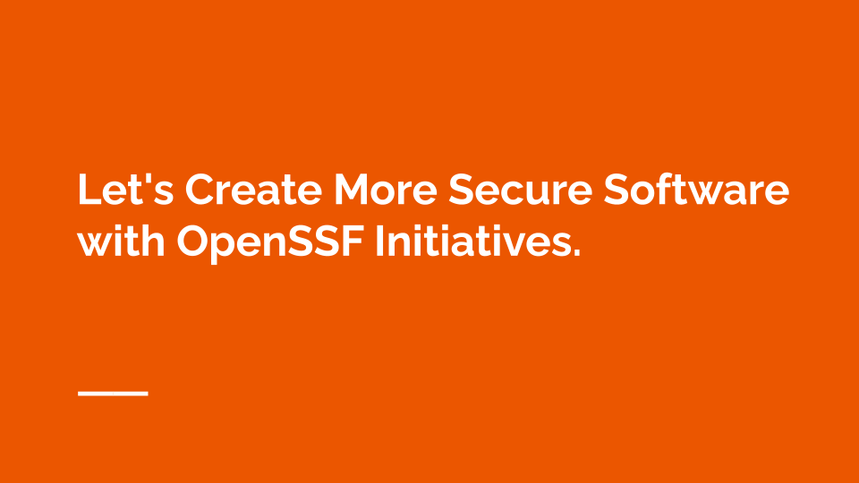

“让我们通过 OpenSSF 的倡议创建更安全的软件。”
我计划继续利用 OpenSSF 的倡议，未来开发出更安全的软件。

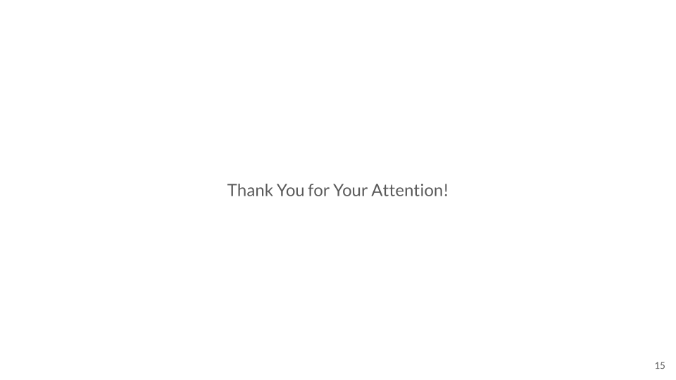

感谢您的关注。

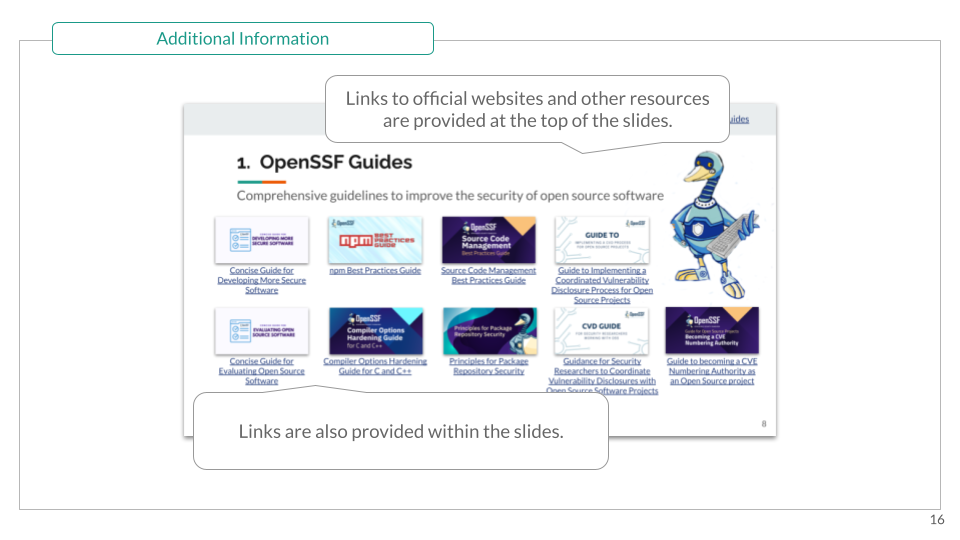

有关更多详细信息，您可以参考演示文稿中链接的幻灯片和附加资源。
