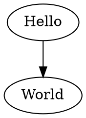
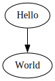

# 创建您的第一个图表

以下是创建一个简单的有向图并生成 DOT 语言的示例。

```typescript
import { digraph, toDot } from 'ts-graphviz';

const G = digraph('G', (g) => {
  g.edge(['Hello', 'World']);
});

console.log(toDot(G));
```

## 生成的 DOT 语言：



## 解释：

- **导入库**：我们从 `ts-graphviz` 导入 `digraph` 函数，它允许我们创建一个有向图。
- **创建图表**：我们使用名称 `'G'` 创建一个新的有向图 `G`。
- **添加边**：在图表上下文中，我们使用 `edge` 方法添加从 `'Hello'` 到 `'World'` 的边。
- **生成 DOT 输出**：我们使用 `toDot()` 函数生成图表的 DOT 语言表示并将其打印到控制台。

## 可视化表示：


