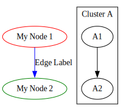

# 基本概念和使用方法

在本节中，我们将介绍 `ts-graphviz` 的基本概念以及如何使用它们来构建图表。

## 创建节点

节点是图表的基本单元，代表实体或对象。

```typescript
g.node('Node1', { label: 'My Node', color: 'red' });
```

**解释：**

- **节点标识符**：`'Node1'` 是该节点的唯一标识符。
- **属性**：通过指定诸如 `label` 和 `color` 之类的属性来自定义节点的外观。

**属性示例：**

- `label`：显示在节点上的文本。
- `color`：节点的颜色。
- `shape`：节点的形状（例如，`box`、`circle`、`diamond`）。

**更多信息：**

- 有关节点属性的完整列表，请参阅 [Graphviz 节点文档](https://graphviz.org/docs/nodes/) 和 [属性列表](https://graphviz.org/doc/info/attrs.html)。

## 创建边

边代表节点之间的关系或连接。

```typescript
g.edge(['Node1', 'Node2'], { label: 'Edge Label', color: 'blue' });
```

**解释：**

- **连接节点**：使用 `['Node1', 'Node2']` 定义节点之间的边。
- **属性**：为边指定诸如 `label` 和 `color` 之类的属性。

**属性示例：**

- `label`：显示在边上的文本。
- `color`：边的颜色。
- `style`：边的样式（例如，`dashed`、`bold`）。

**更多信息：**

- 有关边属性的完整列表，请参阅 [Graphviz 边文档](https://graphviz.org/docs/edges/) 和 [属性列表](https://graphviz.org/doc/info/attrs.html)。

## 使用子图

子图允许您对节点和边进行分组，通常用于创建集群或控制布局。

```typescript
g.subgraph('ClusterA', { label: 'Cluster A' }, (cluster) => {
  cluster.node('A1');
  cluster.node('A2');
  cluster.edge(['A1', 'A2']);
});
```

**解释：**

- **创建子图**：使用 `subgraph` 方法创建一个名为 `'ClusterA'` 的子图。
- **子图属性**：设置诸如 `label` 之类的属性来命名子图。
- **添加节点和边**：在回调函数提供的子图上下文中定义节点和边。

**更多信息：**

- 有关集群的更多详细信息，请参阅 [Graphviz 集群文档](https://graphviz.org/docs/clusters/)。

---

## 综合应用

**示例：**

```typescript
import { digraph } from 'ts-graphviz';

const g = digraph('G', { newrank: true }, (g) => {
  g.node('Node1', { label: 'My Node 1', color: 'red' });
  g.node('Node2', { label: 'My Node 2', color: 'green' });

  g.edge(['Node1', 'Node2'], { label: 'Edge Label', color: 'blue' });

  g.subgraph('ClusterA', { label: 'Cluster A', color: 'lightgrey' }, (cluster) => {
    cluster.node('A1', { shape: 'box' });
    cluster.node('A2', { shape: 'ellipse' });
    cluster.edge(['A1', 'A2'], { style: 'dashed' });
  });
});
```

**可视化表示：**



---

## 额外信息

有关属性及其使用方法的详细信息，请参阅官方 Graphviz 文档：

- [Graphviz 属性列表](https://graphviz.org/doc/info/attrs.html)

这些资源提供了可应用于节点、边和图表的全面属性列表，帮助您自定义可视化效果。
