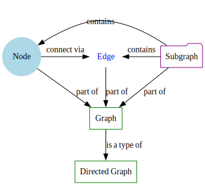

# 词汇表

汇编了与图论和 ts-graphviz 相关的术语。

- **节点**：图表的基本元素，代表实体或对象。
- **边**：表示节点之间连接或关系的线。
- **图**：由节点和边组成的结构。
- **有向图 (Digraph)**：边具有方向的图。
- **子图**：形成图的一部分的节点和边的子集。
- **属性**：定义节点、边或图的外观或行为的属性。
- **DOT 语言**：Graphviz 使用的图描述语言。

:::note

这些关系被可视化以供参考。

:::
