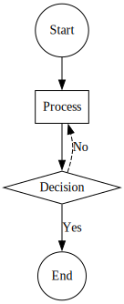

# 创建流程图

流程图用于表示过程或工作流。以下是如何创建一个简单流程图的方法。

```typescript
import { digraph, toDot } from 'ts-graphviz';

const G = digraph('Flowchart', (g) => {
  g.node('Start', { shape: 'circle' });
  g.node('Process', { shape: 'box' });
  g.node('Decision', { shape: 'diamond' });
  g.node('End', { shape: 'circle' });

  g.edge(['Start', 'Process']);
  g.edge(['Process', 'Decision']);
  g.edge(['Decision', 'End'], { label: 'Yes' });
  g.edge(['Decision', 'Process'], {
    label: 'No',
    constraint: false,
    style: 'dashed',
  });
});

console.log(toDot(G));
```

**说明：**

- **具有形状的节点**：不同的形状，如 `circle`（圆形）、`box`（方形）和 `diamond`（菱形）表示不同类型的步骤。
- **连接节点**：边连接步骤以显示流程。
- **边的标签**：边上的标签如 `'Yes'`（是）和 `'No'`（否）表示决策结果。

**可视化：**


