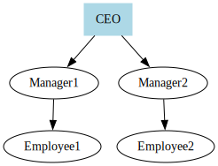

# 创建组织结构图

组织结构图显示组织的结构。

```typescript
import { digraph, toDot } from 'ts-graphviz';

const G = digraph('Organization', (g) => {
  g.node('CEO', { shape: 'box', style: 'filled', color: 'lightblue' });

  g.edge(['CEO', ['Manager1', 'Manager2']]);
  g.edge(['Manager1', 'Employee1']);
  g.edge(['Manager2', 'Employee2']);
});

console.log(toDot(G));
```

**说明：**

- **层级结构**：节点代表职位，边代表汇报线。
- **节点样式**：CEO 节点样式不同，以突出显示。

**可视化：**


